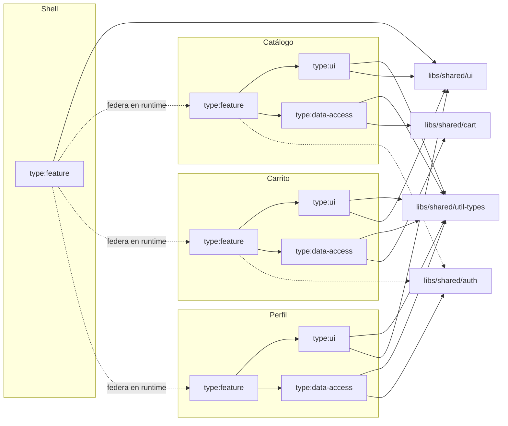
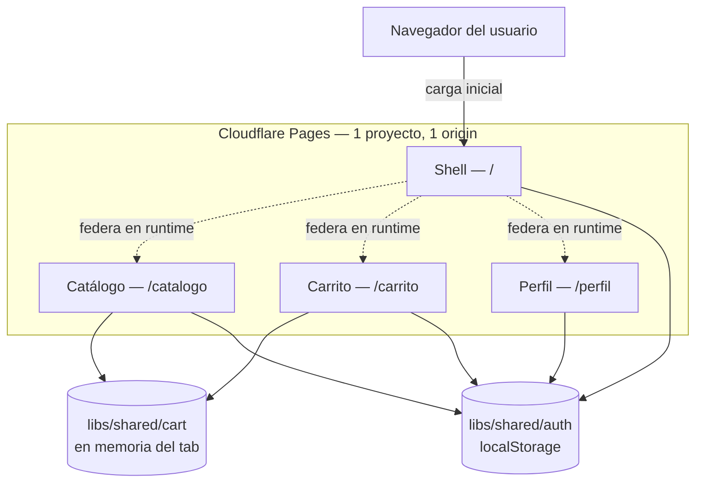

# Architecture Spine — Llano — Monorepo de Microfrontends Angular + Nx

## Design Paradigm

**Micro-frontend: Shell (host) + Remotes, federados en runtime vía Native Federation** (`@angular-architects/native-federation`), sobre el `ApplicationBuilder` (esbuild) de Angular — decisión de capacidad ya fijada en `addendum.md`, ratificada aquí, no reabierta.

Dentro de cada proyecto Nx (Shell, cada Remote, cada lib compartida), las libs se organizan por **tipo Nx estándar**, no por carpetas ad-hoc:

| Tipo | Rol | Puede depender de |
|---|---|---|
| `feature` | Smart components, rutas, orquestación de un dominio (ej. `catalogo-feature-listado`) | `ui`, `data-access`, `util` del mismo `scope`; `util`/`data-access` de `scope:shared` |
| `ui` | Componentes presentacionales puros, sin estado de negocio ni llamadas a `data-access` | `util` del mismo `scope`; `util`/`ui` de `scope:shared` (ej. `catalogo-ui` consume el Design System compartido) |
| `data-access` | Estado y acceso a datos del dominio (services, signals, mocks) | `util` del mismo `scope`; `util`/`data-access` de `scope:shared` (ej. `catalogo-data-access` consume `libs/shared/cart`) |
| `util` | Tipos, helpers puros, sin Angular DI de negocio | nada (hoja del grafo) |

El aislamiento entre dominios (AD-1) lo garantiza el eje de `scope` — un lib de `scope:catalogo` nunca puede alcanzar `scope:carrito`, sin importar el tipo. El eje de `type` solo gobierna la dirección dentro de los tipos permitidos; permitir `ui→ui` y `data-access→data-access` no reabre ese aislamiento porque sigue acotado a `scope:shared` como único destino cross-scope.

Federación estática (MVP1): las URLs de los 3 Remotes están fijas en la configuración del Shell — no hay Manifest ni resolución en runtime (eso es MVP2, ver Deferred).

## Invariants & Rules

### AD-1 — Ningún Remote depende de otro Remote [ADOPTED]

- **Binds:** FR-1, FR-9, todos los Remotes (Catálogo, Carrito, Perfil)
- **Prevents:** acoplamiento directo entre Remotes que rompería la independencia de build/serve que exige FR-9 (ej. Carrito importando código fuente de Catálogo para reusar un componente).
- **Rule:** `apps/catalogo`, `apps/carrito`, `apps/perfil` solo pueden depender de `libs/shared/*`. Ningún Remote importa código de otro Remote, directa ni transitivamente. Enforced vía tags de Nx (`scope:catalogo`, `scope:carrito`, `scope:perfil`, `scope:shared`) + `@nx/enforce-module-boundaries`.

### AD-2 — Dirección de dependencia por tipo de lib [ADOPTED]

- **Binds:** todas las libs del workspace (Shell, Remotes, shared)
- **Prevents:** que un componente `ui` termine llamando `data-access` directo (mezclando presentación con estado), o que `util` importe algo con estado y deje de ser una hoja segura de reusar en cualquier lado.
- **Rule:** `feature → {ui, data-access, util}` → `ui`/`data-access` dependen de `util`, y también de su propio tipo cuando el destino es `scope:shared` (ej. `catalogo-ui → shared-ui`, `catalogo-data-access → shared-cart`) → `util` no depende de nada. Ningún salto hacia atrás (`ui`/`util` nunca importan `feature`; `util` nunca importa `ui`/`data-access`). El aislamiento entre dominios lo sigue garantizando el eje de `scope` (AD-1) — permitir `ui→ui`/`data-access→data-access` no habilita `catalogo-ui → carrito-ui`, solo el camino hacia `scope:shared`. Enforced vía tags de tipo (`type:feature`, `type:ui`, `type:data-access`, `type:util`) + `@nx/enforce-module-boundaries`.



### AD-3 — Estado cross-remote mutado solo vía servicio singleton + Angular Signals [ADOPTED]

- **Binds:** FR-4, FR-6, FR-7, `libs/shared/cart`, `libs/shared/auth`
- **Prevents:** que Catálogo y Carrito implementen cada uno su propia copia del carrito (o su propio mecanismo de reactividad — uno con Signals, otro con RxJS), rompiendo la consistencia cross-remote que FR-4/FR-7 exigen; y que editar el perfil en Perfil (FR-6) deje al Session Widget del header mostrando un nombre desactualizado porque Perfil mutó una copia propia en vez del service compartido.
- **Rule:** `libs/shared/cart` y `libs/shared/auth` exponen un único service `providedIn: 'root'` cada uno, con `signal()`/`computed()` como única fuente de verdad del estado — el total del carrito es un `computed()` derivado de los items, nunca un valor sincronizado a mano. Ningún Remote mantiene su propia copia del carrito o la sesión; todos leen y escriben exclusivamente a través de estos services. Editar nombre/email en Perfil (FR-6) llama al mismo método del service de `libs/shared/auth` que usa el login — no un service local de Perfil. Nada de NgRx ni `BehaviorSubject` para este estado — ver Deferred si el alcance creciera.

### AD-4 — Tipos de entidades cross-remote viven en una lib neutral [ADOPTED]

- **Binds:** FR-4, FR-6, FR-7, `Product`, `CartItem`, `User`/`Session`
- **Prevents:** que Catálogo defina su propio `Product` y Carrito reciba un `CartItem` con una forma ligeramente distinta (ej. `imageUrl` vs `image`), un mismatch que solo aparece en runtime.
- **Rule:** `libs/shared/util-types` (tag `type:util`, `scope:shared`) exporta las interfaces `Product`, `CartItem`, `User`/`Session`. Catálogo, Carrito y Perfil importan estos tipos; ninguno los redefine ni los duplica localmente. `Product.price` (y el precio dentro de `CartItem`) es siempre `number` en unidades decimales de moneda (ej. `19.99`, nunca centavos como entero) — el total del carrito y cualquier texto de precio se formatean con un único helper de `libs/shared/util-types`, no con lógica de formato propia por Remote.

### AD-5 — Fallo de carga de un Remote se aísla en su propio outlet, nunca rompe el Shell [ADOPTED]

- **Binds:** FR-1, estado "Remote no disponible" (`EXPERIENCE.md` State Patterns, Accessibility Floor)
- **Prevents:** que un Remote caído al cargar (404, error de red, parse error) tumbe la navegación completa o el header, que cada Remote implemente su propio manejo de error de forma distinta, y que el estado de error sea solo visual (sin que un lector de pantalla lo anuncie).
- **Rule:** cada ruta federada del Shell envuelve su `loadRemoteModule(...)` en un `.catch()` que resuelve al componente compartido `RemoteUnavailableComponent` (`libs/shared/ui`), renderizado dentro del mismo `<router-outlet>` de esa ruta, con `role="alert"`/`aria-live="polite"` en su contenedor (`EXPERIENCE.md` Accessibility Floor). El botón "Reintentar" vuelve a invocar `loadRemoteModule(...)` solo para esa ruta — nunca un reload de página completa. El header/nav del Shell vive fuera del outlet (ver `EXPERIENCE.md` Header/Nav) y por construcción no se ve afectado por un fallo dentro de él.
- **Alcance explícito:** esta regla cubre fallos de **carga** del Remote (el `import()` federado falla). Un error de runtime dentro de un Remote ya montado (ej. una excepción en el cálculo del total de Carrito) **no** está cubierto — Angular no tiene error boundaries nativos por subárbol de componentes; aislar ese caso queda en Deferred.

### AD-6 — Angular/RxJS y las libs compartidas declaradas Singleton en la config de federación [ADOPTED]

- **Binds:** FR-1, FR-4, FR-7, NFR de Reliability (`prd.md` §7)
- **Prevents:** que Shell y algún Remote carguen versiones distintas de Angular/RxJS (cada uno bundleando la suya), causando "version mismatch" en runtime — el pitfall que `addendum.md` marca como principal; y que, aunque AD-3 fije un único service de carrito/sesión, cada Remote termine bundleando su **propia copia** de esa clase de service por no declararla compartida en la config de federación, rompiendo en la práctica el "no re-login"/carrito consistente que FR-4/FR-7 prometen.
- **Rule:** `federation.config.mjs` (nombre real del archivo en `@angular-architects/native-federation` 22.x, no `.js`) de Shell y los 3 Remotes declara como `shared`: (a) Angular y RxJS con `singleton: true` + `strictVersion: true`/`requiredVersion` fijado; y (b) `libs/shared/auth`, `libs/shared/cart` y `libs/shared/util-types` también como `singleton: true` — así los 4 proyectos referencian la misma instancia de esos services en runtime, no 4 copias independientes. Cualquier dependencia transitiva que estas libs compartidas introduzcan (no solo Angular/RxJS directo) se declara compartida también, siguiendo el mismo criterio.

### AD-7 — Un solo deploy a Cloudflare Pages, cada Remote con su propio base-href y su propia regla de rewrite [ADOPTED]

- **Binds:** FR-11, Structural Seed (Deployment & environments)
- **Prevents:** que el catch-all SPA rewrite del Shell (necesario para deep-links a `/catalogo`, `/carrito`, `/perfil` en su primera carga) se trague las requests de los assets estáticos de cada Remote bajo su sub-path — un failure mode documentado de Cloudflare Pages para este tipo de layout multi-app; y que cada Remote se buildee con un `base-href` distinto al sub-path real donde se sirve, rompiendo sus rutas internas en producción aunque funcione en local.
- **Rule:** cada Remote se buildea con `--base-href=/{remote}/` (`/catalogo/`, `/carrito/`, `/perfil/`) coincidente con su sub-path de deploy. Un script de build combina los 4 `dist/` de Nx en un único directorio de publish para Cloudflare Pages: `publish/` (Shell en la raíz), `publish/catalogo/`, `publish/carrito/`, `publish/perfil/`. El archivo `_redirects` de Cloudflare Pages declara las reglas de cada Remote **antes** que el catch-all del Shell (orden de reglas, primera coincidencia gana): `/catalogo/*  /catalogo/index.html  200`, ídem `carrito`/`perfil`, y solo al final `/*  /index.html  200` para el Shell.

## Consistency Conventions

| Concern | Convention |
| --- | --- |
| Naming (libs, tags) | Libs: `{scope}-{type}-{nombre}` (ej. `catalogo-feature-listado`, `shared-ui-button`). Tags: `scope:{catalogo\|carrito\|perfil\|shell\|shared}` + `type:{feature\|ui\|data-access\|util}`. |
| Naming (rutas del Shell) | `/catalogo`, `/carrito`, `/perfil` — coinciden 1:1 con los Remotes nombrados en `prd.md` §3 Glosario; el Shell no introduce alias. Las rutas hijas dentro de cada Remote (si las hubiera) se anidan bajo ese mismo prefijo, alineadas con el entry expuesto por ese Remote en su `federation.config.mjs` — nunca un path que no calce con lo que el Remote expone. |
| Data & formatos (entidades) | Formas de `Product`/`CartItem`/`User` fijadas una sola vez en `libs/shared/util-types` (AD-4); `id` de producto y de línea de carrito como `string`. |
| Estado & cross-cutting | Mutación de estado compartido solo vía los services de AD-3; ningún componente de `ui` accede a `libs/shared/cart`/`auth` directo — siempre a través de la `data-access`/`feature` de su propio dominio. |
| Persistencia local | `localStorage` para sesión (`libs/shared/auth`) y perfil editado (FR-6); el carrito (`libs/shared/cart`) vive solo en memoria del tab — el PRD excluye explícitamente persistencia de carrito entre sesiones (§4.2 Out of Scope). |
| Exposición de federación | Cada Remote expone en su `federation.config.mjs` solo rutas/componentes lazy de su `feature` lib (ej. `./Routes` apuntando a `catalogo-feature-listado`) — nunca el `AppModule`/bootstrap completo del Remote. Antipatrón documentado por angular-architects que `addendum.md` señala explícitamente. |
| Estilos | Un único `tailwind.config` en la raíz del workspace, extendido (no redefinido) por Shell y los 3 Remotes — los tokens de `DESIGN.md` (colores, tipografía, spacing, rounded) se mapean ahí una sola vez, no por proyecto. |
| Performance budget | Bundle inicial del Shell `<300KB` gzip (`prd.md` §9) — se mide con cada build de producción; si el reporte de Nx/esbuild lo supera, es un blocker de esa fase, no un "ajustar después". |

## Stack

| Name | Version |
| --- | --- |
| Nx | 23.1 (mínimo requerido para Angular 22 según la matriz oficial Nx↔Angular) |
| Angular | 22 |
| @angular-architects/native-federation | 22.0.6 |
| Node.js | 24 (Active LTS) |
| TypeScript | `strict: true`, versión fijada por el preset de Nx 23.1/Angular 22 |
| Tailwind CSS | última estable compatible con Angular 22 — config única en la raíz del workspace (ver Consistency Conventions) |
| Hosting (producción) | Cloudflare Pages, free tier, un solo proyecto/deploy |

*(Versionado de `libs/shared/*`: implícito por commit del monorepo, sin publicación a npm ni semver formal — `prd.md` §9, ADOPTED.)*

**Política de pinning (`prd.md` §9, ADOPTED):** las versiones de esta tabla se fijan al iniciar Fase 0 y quedan congeladas para el resto del roadmap (§10) — sin bumps salvo un blocker real (ej. vulnerabilidad de seguridad). Un bump de Angular/RxJS actualiza `package.json` de la raíz **y** los 4 `federation.config.mjs` (Shell + 3 Remotes) en el mismo commit — nunca por separado, para no reintroducir version mismatch entre Remotes construidos en fases distintas.

## Structural Seed



Deployment & environments: un solo entorno de producción (Cloudflare Pages, build único que empaqueta Shell + 3 Remotes en sub-paths, ver AD-7) más el entorno local de cada desarrollador (`nx serve <proyecto>`, FR-9). Sin staging — no lo justifica un proyecto solo-operador sin usuarios reales (`prd.md` §2.2).

```text
{repo-root}/
  apps/
    shell/            # Host — federa los 3 Remotes, layout persistente (header/nav)
    catalogo/         # Remote — shell de rutas del dominio Catálogo (compone libs catalogo-feature-*)
    carrito/          # Remote — shell de rutas del dominio Carrito/Checkout
    perfil/           # Remote — shell de rutas del dominio Perfil
  libs/
    catalogo/
      feature-listado/    # type:feature, scope:catalogo
      ui/                 # type:ui, scope:catalogo
      data-access/        # type:data-access, scope:catalogo
    carrito/
      feature-carrito/    # type:feature, scope:carrito
      ui/                 # type:ui, scope:carrito
      data-access/        # type:data-access, scope:carrito
    perfil/
      feature-perfil/     # type:feature, scope:perfil
      ui/                 # type:ui, scope:perfil
      data-access/        # type:data-access, scope:perfil
    shared/
      ui/                 # type:ui, scope:shared — Design System (Botón, Card, Header/Nav, Category Chip, etc. — DESIGN.md Components)
      auth/               # type:data-access, scope:shared — Sesión Compartida (AD-3)
      cart/               # type:data-access, scope:shared — Carrito Compartido (AD-3)
      util-types/         # type:util, scope:shared — Product/CartItem/User (AD-4)
```

## Capability → Architecture Map

| Capability / Area | Lives in | Governed by |
| --- | --- | --- |
| FR-1 Enrutamiento federado | `apps/shell` (rutas + config de federación) | Design Paradigm, AD-5, AD-6 |
| FR-2 Navegación persistente | `apps/shell` (layout) + `libs/shared/ui` (Header/Nav) | Consistency Conventions (naming rutas), `DESIGN.md` Header/Nav |
| FR-3 Listado y filtro de Catálogo | `libs/catalogo/feature-listado`, `libs/catalogo/ui`, `libs/catalogo/data-access` | AD-2 (dirección de dependencia) |
| FR-4 Agregar al carrito (cross-remote) | `libs/catalogo/data-access` (escribe) + `libs/shared/cart` (dueño del estado) | AD-3, AD-4 |
| FR-5 Gestión de carrito y checkout simulado | `libs/carrito/feature-carrito`, `libs/carrito/ui`, `libs/carrito/data-access` | AD-2, AD-3 |
| FR-6 Ver/editar Perfil mock | `libs/perfil/*` + `libs/shared/auth` (dueño del estado editado) | AD-2, AD-3, AD-4 |
| FR-7 Sesión consistente entre Remotes | `libs/shared/auth` | AD-3 |
| FR-8 Componentes base sin duplicación | `libs/shared/ui` | AD-1, AD-2 |
| FR-9 Serve/build aislado por Remote | `apps/catalogo`, `apps/carrito`, `apps/perfil` (proyectos Nx independientes) | AD-1, Design Paradigm (federación estática) |
| FR-10 README + diagrama | fuera del código — artefacto de repo (README.md) | No gobernado por ADs de código; el deck de portafolio (artefacto separado de este spine) reusa sus diagramas |
| FR-11 Demo pública desplegada | Cloudflare Pages (1 proyecto) | AD-7, Stack, Structural Seed (deployment) |

## Deferred

- **Profundidad de testing (unit/e2e cross-remote):** `prd.md` Open Question 4 sigue sin resolver — esta arquitectura no fija framework ni cobertura mínima. Revisitar cuando esa pregunta se cierre (probable en `bmad-create-epics-and-stories` o al iniciar Fase 0).
- **CI/CD con deploy independiente por Remote:** explícitamente diferido a una extensión futura por `prd.md` §6.2 — el deploy único a Cloudflare Pages (AD de hosting) es deliberadamente MVP1-only. Revisitar si esa extensión se confirma.
- **Federación dinámica vía Manifest (MVP2):** `prd.md` §6.3 ya fija la dirección (Manifest en runtime en vez de URLs estáticas) pero no su forma — esquema del Manifest, mecanismo de resolución, y si sigue viviendo en `apps/shell` o se extrae a una lib nueva quedan sin decidir hasta que arranque esa fase.
- **Comparación con Module Federation clásico:** `prd.md` Open Question 1 — exploración opcional, no bloquea MVP1.
- **Escalar `libs/shared/cart`/`auth` a NgRx:** si el estado compartido creciera en complejidad (ej. undo/redo, side-effects encadenados), AD-3 se revisita — hoy Signals cubre el alcance de MVP1 sin sobre-ingeniería.
- **Aislamiento de errores de runtime dentro de un Remote ya montado** (AD-5 solo cubre fallos de *carga*): Angular no tiene error boundaries nativos por subárbol de componentes; una excepción de runtime en un Remote montado (ej. un bug en el cálculo del total de Carrito) hoy puede tumbar el Shell completo. Cerrar esto requeriría un `ErrorHandler` custom con lógica de aislamiento por ruta — evaluar si vale la pena para una demo de portafolio o si alcanza con QA manual antes del deploy de cada fase.
